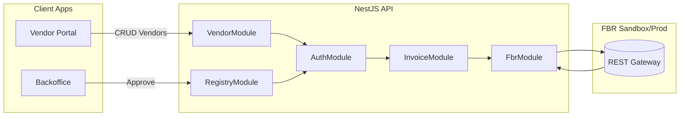

## FBR Digital Invoicing Architecture

### Module Summary

- `VendorModule`: Handles self-service registration (business type + role), admin CRUD, and password hashing.
- `RegistryModule`: tracks registration workflow, updates vendor registration status.
- `AuthModule`: validates email/password logins, mints bearer tokens, and exposes helpers to validate/resolve tokens.
- `InvoiceModule`: validates invoice payloads and relays to FBR after injecting vendor/token metadata.
- `FbrModule`: isolates outbound HTTP calls to FBR sandbox/prod URLs with logging and correlation IDs.
- `Guards & Decorators`: `AuthGuard`, `RolesGuard`, `Roles` decorator, and `CurrentVendor` decorator enforce bearer authentication + RBAC across controllers.
- `Common`: global logging interceptor, enums, DTO helpers used by modules.

Routers are versioned (`/v1/...`), documented via Swagger (`/docs`), and instrumented with the logging interceptor for team-ready observability.

